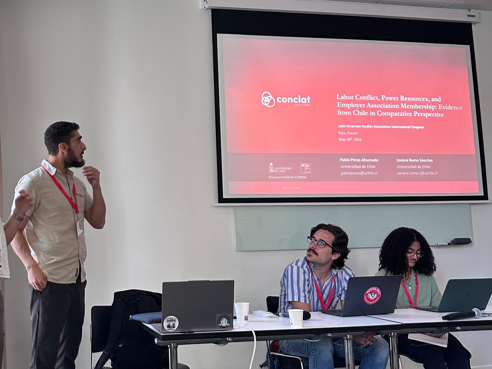
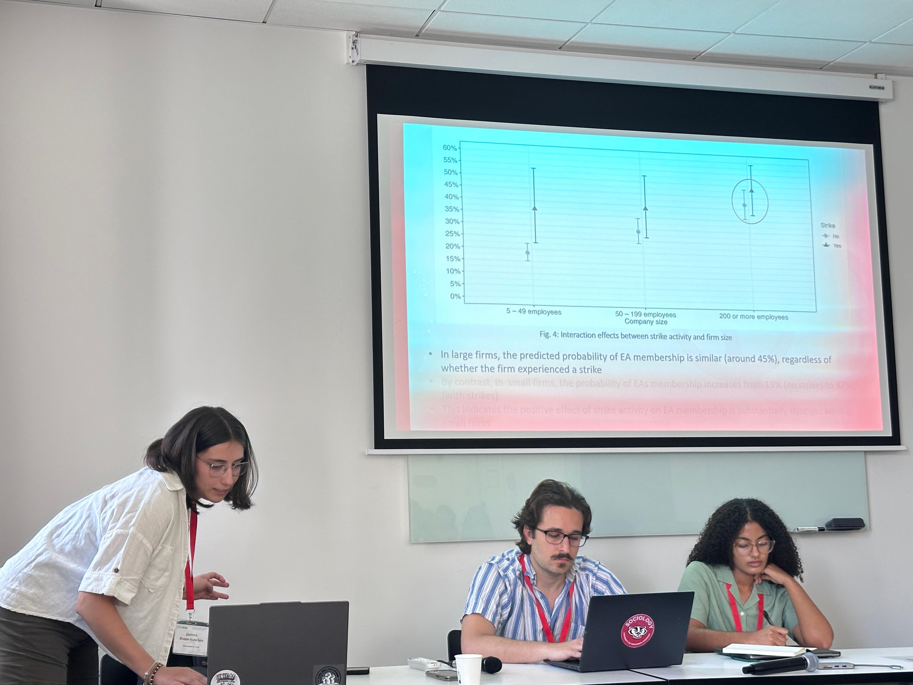
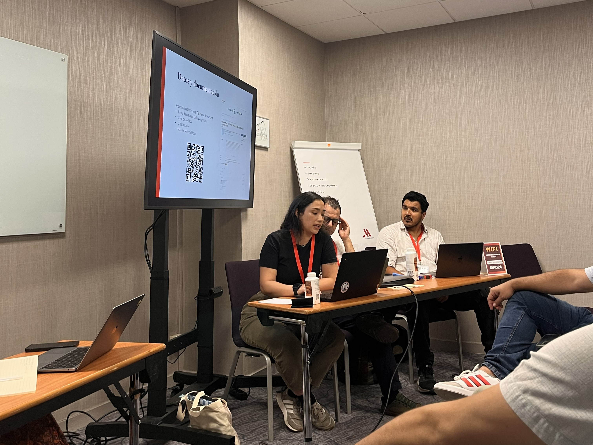
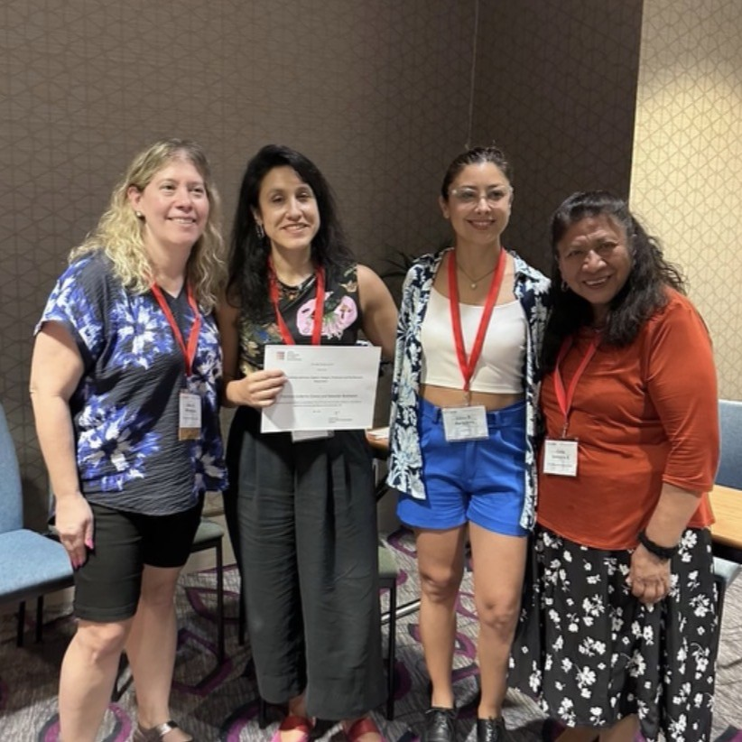
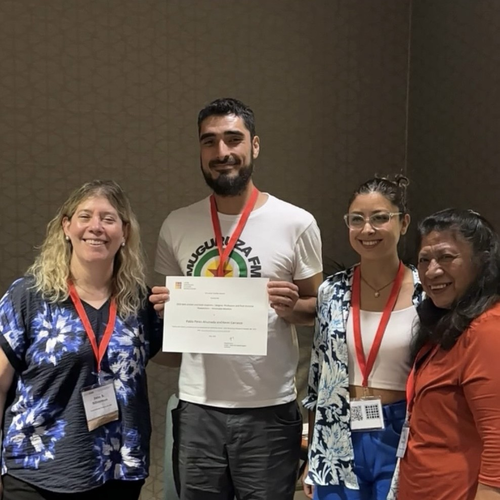

{.post-cover}

## Sobre el 44° Congreso Internacional de LASA

Entre el 26 y el 30 de mayo de 2026 se realizó en París, Francia, el 44° Congreso Internacional de la Latin American Studies Association (LASA2026). LASA es la asociación profesional más grande del mundo dedicada a los estudios latinoamericanos, y reúne a investigadores de distintas disciplinas interesados en América Latina y el Caribe.

La edición 2026 tuvo un carácter especial por dos motivos. Coincidió con el 60° aniversario de la asociación. Además, con cinco días de actividades, fue el congreso internacional más extenso organizado por LASA hasta la fecha. Bajo el tema "República y Revolución", el congreso reunió a participantes de 69 países e incluyó paneles presidenciales, sesiones invitadas, una feria del libro y un festival internacional de cine. También formó parte de las *Semaines de l'Amérique latine et des Caraïbes*, organizadas por el Ministerio de Europa y Asuntos Exteriores de Francia.

El equipo del proyecto participó con dos ponencias en la sección de Trabajo y Estudios Laborales (LAB). Además, el equipo fue parte de la Buisiness meeting de la sección laboral de LASA.

## Ponencia Labor Conflict and Employer Association Membership: evidence from Chile in Comparative Perspective

La ponencia fue presentada en la jornada del 26 de mayo de 2026 por [Pablo Pérez Ahumada](../../../nosotros/miembros/perez.qmd) y [Javiera Romo Sánchez](../../../nosotros/miembros/romo.qmd). Se presentó en el panel *The Political Economy of Labor Conflicts in Latin America*, en el que Pablo Pérez Ahumada participó además como comentarista.

En esta investigación, los autores analizan si el poder de los trabajadores influye en la decisión de las empresas de afiliarse a asociaciones empresariales. El trabajo se inscribe en el enfoque de recursos de poder y enfatiza una comprensión relacional del poder: las asociaciones empresariales serían, en parte, una respuesta organizada de los empleadores frente al poder sindical.

A partir de datos de la Encuesta Laboral (ENCLA 2023) del Instituto Nacional de Estadísticas de Chile y la Dirección del Trabajo, y mediante modelos de regresión logística, los resultados muestran que tanto la densidad sindical como la actividad huelguística aumentan significativamente la probabilidad de que una empresa pertenezca a una asociación empresarial. Estos hallazgos respaldan y amplían el enfoque de recursos de poder y sugieren que la literatura debería prestar mayor atención al poder asociativo empresarial.

::: {layout-ncol=2}

:::

## Ponencia Job Autonomy, Union Membership, and Partisan Participation: Distinct Spillover Effects from the Workplace to Politics in Chile

La ponencia fue presentada en la jornada del 30 de mayo de 2026 por [Daniela Olivares Collío](../../../nosotros/miembros/olivares.qmd) en el panel *Unions, Labor Movements, and Workers' Power*, que ella misma presidió. El trabajo examina...

## Business meeting de la Sección de Estudios Laborales

El miércoles 27 de mayo se realizó el *business meeting* de la Sección de Estudios Laborales (Labor Studies Section) de LASA, del cual formó parte nuestro equipo. En la reunión se entregó el Premio 2025 a los mejores artículos en el área de estudios laborales.

Dos integrantes de nuestro equipo fueron reconocidos en la categoría de docentes e investigadores postdoctorales:

- **Primer lugar:** [Francisca Gutiérrez Crocco](../../../nosotros/miembros/gutierrez.qmd), junto a Sebastián Budnevich, por el artículo *Resistance, accommodation, or assimilation? The contested role of worker solidarity in food delivery platforms*, publicado en *Economic and Industrial Democracy* (2025).
- **Mención honrosa:** [Pablo Pérez Ahumada](../../../nosotros/miembros/perez.qmd), junto a Kevin Carrasco, por el artículo [*Política de clases y confianza en los sindicatos en América Latina*](../../../investigacion/posts/2024-12-18-perez-carrasco/index.qmd), publicado en *Latin American Research Review* (2025).

Estos reconocimientos reflejan el trabajo sostenido del equipo en la investigación sobre relaciones laborales, sindicalismo y conflicto laboral en Chile y América Latina.

::: {layout-ncol=2}

:::

  <a class="btn btn-sm btn-primary" href="https://lasaweb.org/es/lasa2026/final-program/" target="_blank" rel="noopener">Ver programa</a>

