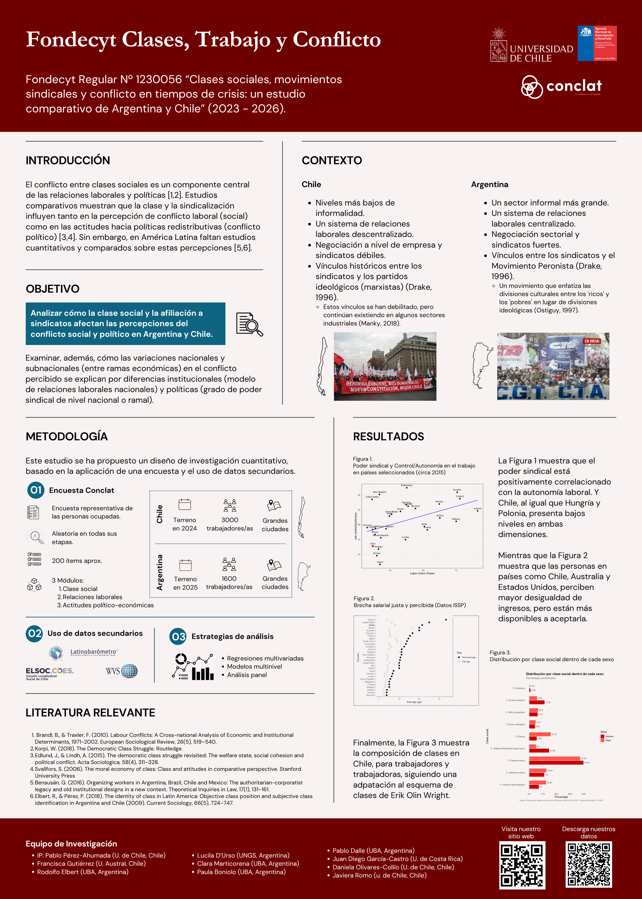

# Primer Congreso Chileno de Estudios del Trabajo
La iniciativa impulsada por la [Asociación Chilena de Estudios del Trabajo](https://acetchile.cl/index.php) reunió a más de 100 personas del mundo académico, sindical y político a reflexionar en torno a los nuevos escenarios del trabajo en América Latina. El evento se desarrolló el 9, 10 y 11 de abril en la [Universidad Austral de Chile](https://www.uach.cl/) y contó con numerosas ponencias, simposios, exposiciones fotográficas y presentaciones de pósters y libros.

## Poster “Clases sociales, movimientos sindicales y conflicto en tiempos de crisis: un estudio comparativo de Argentina y Chile”
Al cierre de la primera jornada del congreso, se presentó el póster **“Clases sociales, movimientos sindicales y conflicto en tiempos de crisis: un estudio comparativo de Argentina y Chile”**, elaborado por [Pablo Pérez Ahumada](https://conclat.com/nosotros/miembros/01-pabloperez/) y [Daniela Olivares Collío](https://conclat.com/nosotros/miembros/09-danielaolivares/). El trabajo expone el [Proyecto Conclat](https://conclat.com/), sus objetivos, el diseño de la encuesta y algunos de sus principales resultados.

  <a class="btn btn-sm btn-primary" href="https://drive.google.com/file/d/1VrQSj6-s5guCl1FMDyRhnC_u_Ix0leQe/view" target="_blank" rel="noopener">Ver programa</a>

