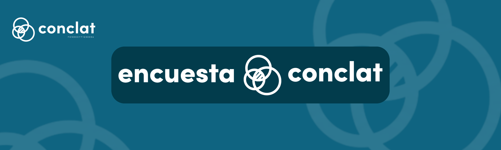

::: {.full-bleed}
{.banner-img}
:::
:::

::: {.text-center}
[Descargar base de datos](https://dataverse.harvard.edu/dataset.xhtml?persistentId=doi:10.7910/DVN/URQRDQ){.btn .btn-lg role="button" target="_blank" style="background-color:#023C4C; color:#ffffff; border:none; font-weight:600;"}
:::

## Sobre la Encuesta CONCLAT

La encuesta CONCLAT, aplicada en Chile (2024-2025) y Argentina (2025), busca contribuir al estudio de las clases sociales y del conflicto laboral y político. Forma parte del proyecto Fondecyt Regular N° 1230056, *"Clases sociales, movimientos sindicales y conflicto sociopolítico: un estudio comparativo de Argentina y Chile"* (2023-2027).

La encuesta CONCLAT buscó profundizar en el estudio de las clases sociales y del conflicto laboral y político, a partir de esquemas teóricamente fundamentados como el neomarxista de Erik Olin Wright. Consiste en tres módulos de preguntas: primero, antecedentes demográficos y clase social; segundo, trabajo, relaciones laborales y condiciones de empleo; y tercero, percepciones sobre la situación político-económica actual.

En Chile, la encuesta se aplicó entre el 19 de noviembre de 2024 y el 20 de enero de 2025 a 3.048 personas trabajadoras, residentes en las 15 regiones del país. En Argentina, se aplicó entre abril y agosto de 2025 a 1.698 personas, en la Ciudad de Buenos Aires, el conurbano bonaerense y otras ciudades de las seis regiones geográficas del país.

### Fechas y lugares de aplicación

La encuesta se aplicó en Chile entre el 19 de noviembre de 2024 y el 20 de enero de 2025, en las 15 regiones del país. En Argentina, se aplicó entre abril y agosto de 2025, en la Ciudad de Buenos Aires, el conurbano bonaerense y otras ciudades distribuidas en las seis regiones geográficas del país (Área Metropolitana de Buenos Aires, Centro, NOA/Cuyo, Pampeana, Nordeste y Patagonia).

En ambos países, el diseño muestral permite obtener información representativa de la población nacional urbana ocupada (es decir, que se encuentre trabajando en un empleo remunerado al momento de aplicarse la encuesta).

### Objetivos

El estudio busca comprender cómo la clase social y la afiliación sindical influyen en:

- El **conflicto social**, entendido como la percepción de tensiones en el trabajo (por ejemplo, entre empresarios y trabajadores) y la atribución de responsabilidad por problemas como el desempleo y la inflación.
- El **conflicto político**, relacionado con las actitudes hacia políticas redistributivas, la extensión de derechos laborales y el rol del Estado.

Además, examina la relación entre ambos tipos de conflicto y cómo estas dinámicas varían entre Chile y Argentina, y entre distintos sectores económicos según su nivel de organización sindical.

### ¿Por qué Chile y Argentina?

Ambos países fueron seleccionados por representar modelos laborales divergentes, lo que permite una comparación especialmente reveladora. Argentina cuenta con un sistema corporativista, caracterizado por la negociación colectiva sectorial centralizada, el reconocimiento legal de la representación sindical exclusiva por rama ("personería gremial") y tasas de afiliación cercanas al 40% a fines de los años 2000. Chile, en cambio, tiene un modelo altamente descentralizado, con negociación colectiva a nivel de empresa y una afiliación sindical que no ha superado el 18% en las últimas décadas.

Esta divergencia permite examinar no solo si existen diferencias entre ambos países, sino también cómo un mismo fenómeno —como estar afiliado a un sindicato— puede producir efectos distintos según el contexto institucional en que ocurre.

### Aspectos prácticos: acceso y uso de los datos

La base de datos, el cuestionario y el libro de códigos de la encuesta CONCLAT están disponibles de forma pública en Harvard Dataverse. Por el momento solo se encuentra disponible la base de datos chilena. Próximamente se publicará la Argentina.

**Antes de trabajar con los datos, se recomienda revisar dos documentos en conjunto:**

- **El Manual Metodológico**, que describe el diseño del estudio, la construcción de la muestra, el trabajo de campo y los procedimientos de codificación y validación aplicados en Chile y Argentina.
- **El Libro de Códigos**, un documento independiente que detalla todas las variables de la base de datos: etiquetas, valores posibles, restricciones y notas de codificación.

::: {.text-center}
[Descargar base de datos](https://dataverse.harvard.edu/dataset.xhtml?persistentId=doi:10.7910/DVN/URQRDQ){.btn .btn-lg role="button" target="_blank" style="background-color:#023C4C; color:#ffffff; border:none; font-weight:600;"}
:::

#### Cómo citar

**Para citar los datos:**

> Pérez Ahumada, Pablo. (2026). *Classes, Work and Conflict Survey (CONCLAT): Chile and Argentina 2025*. Harvard Dataverse, V1. https://doi.org/10.7910/DVN/URQRDQ

**Para citar el manual metodológico:**

> Pérez Ahumada, P., Olivares Collío, D., Romo Sánchez, J. (2026). *Dataset Documentation Paper*.
